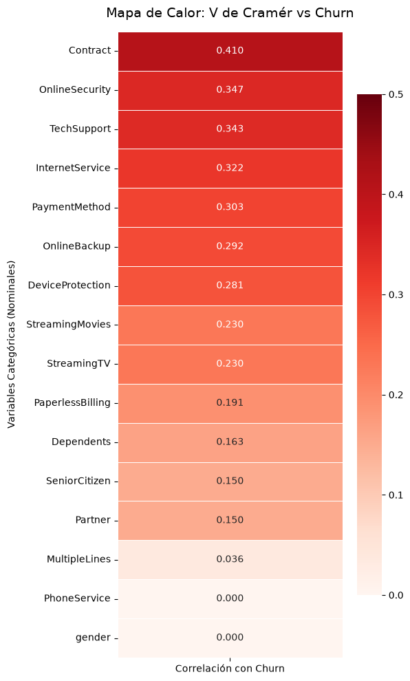
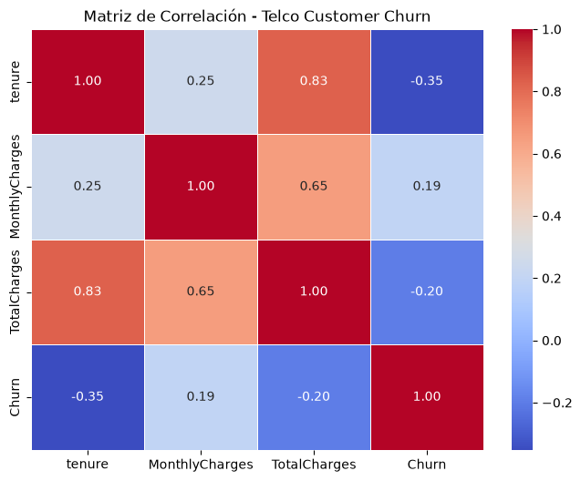
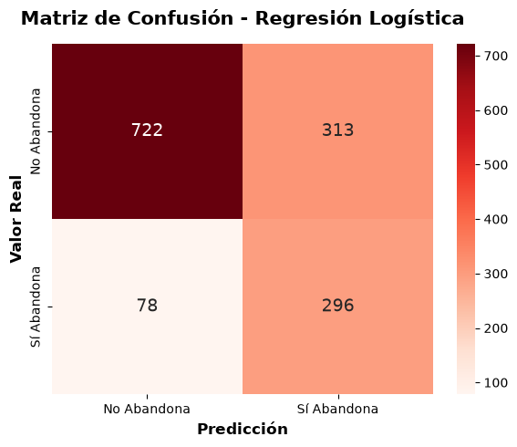
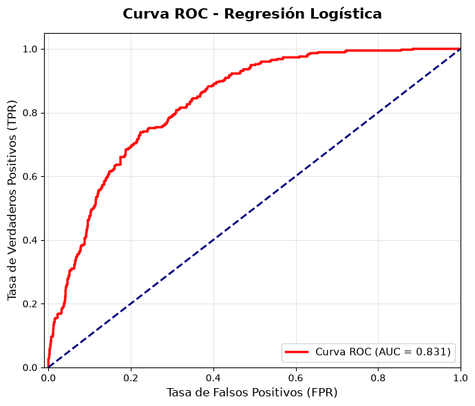
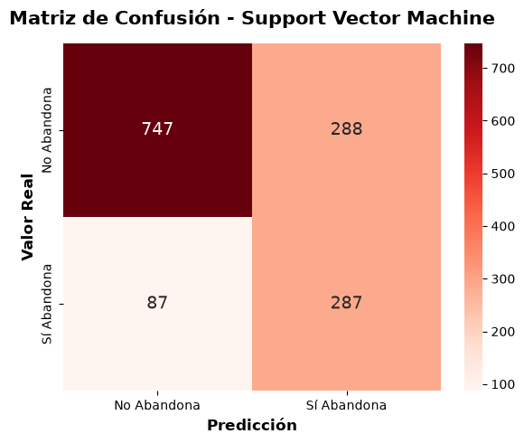
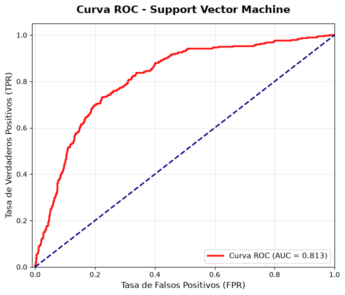
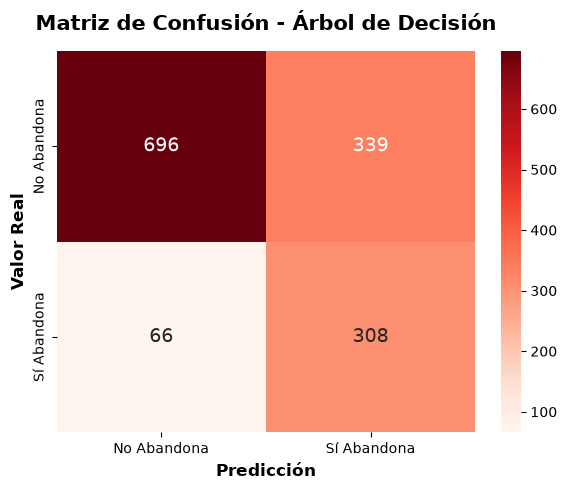
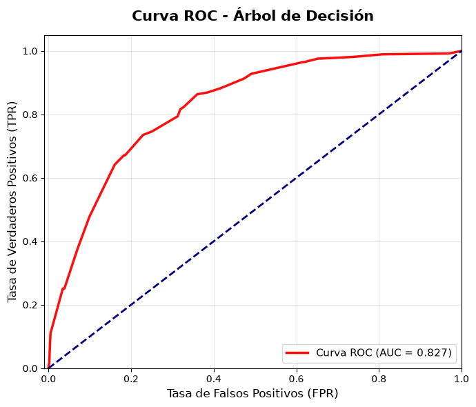

# Informe Técnico: Implementación de Modelos de Machine Learning en Telecomunicaciones

    - Equipo de Trabajo: Felipe Huincaman, David  Ramírez Luna y Octavio Chávez
    - Asignatura: Machine Learning
    - Docente: Profesora Jazna Meza Hidalgo
    - Fecha de elaboración:

# 1. Problema de negocio
Para las empresas de telecomunicaciones, retener clientes es un desafío enorme. En un mercado donde los usuarios necesitan conectividad a diario, es muy fácil que se vayan a la competencia por un corte, una mala experiencia o una mejor oferta. Por esto, la tasa de abandono (churn) es uno de los mayores riesgos económicos del sector. Si consideramos que conseguir un cliente nuevo cuesta hasta cinco veces más que mantener a uno actual, no controlar la fuga se convierte en una pérdida directa de ingresos que golpea las ganancias de la empresa.

Para reducir este problema, es necesario actuar antes de que el usuario decida irse. Desde el análisis de datos, el desafío consiste en responder a tres preguntas clave: ¿Cómo se agrupan nuestros clientes según sus hábitos de consumo y facturación?, ¿Cuáles de ellos están a punto de cancelar su servicio?, y ¿Cuánto tiempo extra estimamos que cada usuario se quedará con nosotros?

Al entender los distintos perfiles mediante la segmentación, predecir con precisión quiénes se van a ir y calcular su tiempo de permanencia, la empresa puede gastar mejor su presupuesto. Esto le permite al equipo comercial enfocarse en los usuarios que generan más valor, armar campañas a la medida de cada grupo y mejorar el servicio antes de que aparezcan reclamos, haciendo que retener clientes sea la base para que la empresa siga creciendo.

# 2. Objetivos del proyecto
## Objetivo general del proyecto:
Crear una estrategia basada en datos para reducir la pérdida de dinero por el abandono de clientes en la empresa de telecomunicaciones. Esto se apoya en agrupar a los usuarios según cómo se comportan y consumen, detectar a tiempo quiénes van a cancelar, y calcular cuánto tiempo se espera que se quede cada cliente. El fin de esto es armar campañas de fidelización a la medida y gastar mejor el presupuesto del equipo de retención.

## Objetivos específicos de etapa de Implementación de Modelos de Machine Learning:
1. Comprensión de la base de clientes: Analizar el historial y las características de los usuarios para encontrar los factores y motivos reales que provocan la cancelación del servicio, entregando datos confiables para tomar decisiones.
2. Segmentación del mercado: Identificar y definir perfiles de clientes que consumen y pagan de forma similar, para que el equipo de marketing pueda armar campañas de fidelización pensadas y adaptadas para cada grupo.
3. Detección de fugas: Identificar con anticipación a los clientes que tienen una alta probabilidad de abandonar la compañía, entregando alertas tempranas para poder actuar antes de que el usuario cierre su cuenta.
4. Proyección de valor y permanencia: Calcular cuánto tiempo más se espera que se queden los usuarios activos, para enfocar la plata de retención en aquellos clientes que dejen más ganancias a largo plazo para la empresa.
5. Validación de la solución: Asegurar que los modelos predictivos sean precisos y confiables, garantizando que las estrategias comerciales y la inversión en retención se basen en cálculos reales que reduzcan los gastos por falsas alarmas o fugas que no vimos venir.
6. Responsabilidad ética: Revisar el impacto comercial y social del proyecto, asegurando que se respete la privacidad de los clientes, que sus datos se usen de forma transparente y que no haya sesgos ni discriminación al armar las campañas de fidelización.

# 3. Definición de KPIs que resolverán el problema de negocio
Para asegurar que los modelos de Machine Learning generen resultados medibles en la empresa, el desempeño del proyecto se evaluará utilizando los siguientes Indicadores Clave de Desempeño (KPIs):

## Tasa de Retención Predictiva
Mide el porcentaje de clientes en riesgo de fuga que logran ser retenidos tras ser contactados por la empresa.
- Se calcula dividiendo la cantidad de clientes que aceptaron la oferta de retención por el total de usuarios que el modelo clasificó como propensos a irse, expresando el resultado como un porcentaje.
- Valida si el modelo de clasificación funciona en la práctica, comprobando si la detección anticipada se traduce en una reducción real de la pérdida de clientes.

## Proyección de Ingresos Recuperados
Cuantifica el impacto financiero de retener a un usuario en riesgo, calculando los ingresos que asegura su permanencia en la compañía.
- Se obtiene multiplicando la cuota mensual del cliente por los meses que el modelo de regresión predice que se quedará (variable Tenure). Al sumar estos valores individuales, se obtiene el total de ingresos recuperados.
- Conecta el modelo de regresión con los resultados financieros, permitiendo enfocar los esfuerzos comerciales en retener a los clientes que dejarán mayor rentabilidad a largo plazo.

## Retorno de Inversión (ROI) de la Retención
Evalúa la rentabilidad de las campañas de retención al dirigir las ofertas solo a los clientes marcados en riesgo real, comparando lo gastado en descuentos contra los ingresos recuperados.
- Se calcula restando el costo total de la campaña a los ingresos futuros recuperados. Este beneficio neto se divide por el costo de la campaña para revelar el porcentaje de ganancia sobre la inversión.
- Demuestra la eficiencia del algoritmo al reducir los Falsos Positivos. Al evitar entregar descuentos a clientes que no tenían intención de cancelar el servicio, se optimiza el presupuesto.

## Índice de Fuga por Clúster
Calcula la proporción de cancelaciones que ocurren dentro de cada segmento de clientes, agrupados previamente según sus patrones de consumo.
- Se obtiene dividiendo la cantidad de clientes que abandonaron el servicio dentro de un segmento (Clúster) por el número total de usuarios en ese mismo grupo, identificando el porcentaje de fuga en ese nicho específico.
- Valida el modelo de clustering y proporciona datos precisos para identificar si el abandono afecta a la base completa de manera uniforme, o si se concentra en un perfil particular de usuarios.

# 4. Metodología utilizada (CRISP-DM)
Para estructurar y ejecutar este proyecto se adoptó la metodología CRISP-DM, asegurando un desarrollo ordenado y enfocado en resolver el problema del negocio.

1. Comprensión del Negocio: Se evaluó el impacto financiero del abandono de clientes en la empresa. Para abordarlo, se definieron objetivos analíticos de clasificación, regresión y segmentación, cuyo éxito se medirá utilizando los KPIs de retención y rentabilidad definidos previamente.
2. Comprensión de los Datos: Se cargó un dataset de 7043 registros y 21 variables. La exploración inicial mostró un desbalance en la variable objetivo, con una tasa de abandono del 26,5%. Además, se observó que los clientes que abandonan tienen una permanencia media de 17,98 meses frente a los 37,57 meses de los usuarios activos, y pagan cargos mensuales más altos.
3. Preparación de los Datos: El proceso de limpieza y transformación en Python incluyó:
    - Anonimización: Se aplicó la función hash SHA-256 (cifrado irreversible) a los identificadores para proteger la privacidad de los usuarios cumpliendo con la normativa. 
    - Tratamiento de Nulos: Se imputaron con cero los 11 valores nulos detectados en los cargos totales, ya que correspondían a clientes nuevos con cero meses de antigüedad.
    - Revisión de Calidad: Se verificó que no existían registros duplicados ni valores atípicos extremos en las variables numéricas utilizando el método del Rango Intercuartil (IQR). 
4. Modelado: Con los datos procesados mediante pipelines de Scikit-Learn, el desarrollo se dividió en tres enfoques:
    - Clasificación: Modelos supervisados para predecir la probabilidad de que un cliente abandone el servicio.
    - Regresión: Algoritmos supervisados para estimar la cantidad de meses que el usuario permanecerá activo en la empresa.
    - Segmentación (Clustering): Algoritmos no supervisados para agrupar clientes con comportamientos similares y detectar anomalías.
5. Evaluación: El desempeño de los modelos se evaluó primero mediante métricas matemáticas (como Exactitud, Precisión y Recall). Luego, esos resultados se conectaron con los KPIs de negocio para medir su utilidad real para la empresa. 
6. Despliegue: El proyecto se estructuró de forma reproducible, separando los directorios para datos, notebooks de experimentación y código fuente. El entregable final se compone de los notebooks de Jupyter documentados y este informe técnico en formato Markdown.

# 5. Descripción General y Calidad del Conjunto de Datos
El proyecto utiliza el dataset "Telco Customer Churn", que contiene el historial y estado de retención de los clientes de una empresa de telecomunicaciones. El archivo está compuesto por 7.043 registros (un cliente por fila) y 21 características (columnas).

La información se agrupa en cuatro categorías principales:

- Variable de abandono: Indica si el cliente se dio de baja o canceló su servicio durante el último mes. Está representada en la variable objetivo Churn.
- Servicios suscritos: Detalla los productos contratados por cada cliente. Esto incluye servicio telefónico, múltiples líneas, tipo de internet, seguridad en línea, respaldo en la nube, protección de dispositivos, soporte técnico y streaming de TV y películas.
- Información de la cuenta: Atributos sobre el contrato y el historial de facturación del cliente, tales como la cantidad de meses que lleva en la compañía (tenure), el tipo de contrato, el método de pago, el uso de facturación electrónica, los cargos mensuales y los cargos totales acumulados.
- Información demográfica: Características del perfil del cliente. Incluye su género, un indicador de si es adulto mayor (SeniorCitizen), y su situación familiar para saber si convive con pareja o tiene dependientes.

# 6. Preparación y análisis exploratorio de los datos (EDA)
Antes de entrenar los modelos, se revisó y exploró la base de datos para asegurar su calidad y entender cómo se comportan los clientes.

## 6.1 Revisión y calidad de los datos
La revisión de los 7043 registros confirmó que los datos están en muy buen estado:
- Anonimización: Se aplicó un hash SHA-256 a la identificación de cada cliente para proteger la privacidad de los usuarios desde el principio.
- Completitud e Imputación: Los datos vienen limpios. Solo encontramos 11 valores nulos en los cargos totales. Como corresponden a clientes nuevos con cero meses de antigüedad, simplemente se rellenaron con el valor cero.
- Valores atípicos (Outliers): Al evaluar con el método de Rango Intercuartil (IQR), se comprobó que no hay valores atípicos en la antigüedad ni en los cargos mensuales y totales.
- Duplicidad: No se detectaron registros duplicados.   

## 6.2 Análisis Descriptivo y Comportamiento del Cliente
La exploración de los datos permitió identificar patrones claros en el perfil, el consumo y las tendencias de cancelación que servirán como base para los futuros modelos.

### Perfil Demográfico y Distribución de Servicios:
La base está equilibrada por género, con 3555 hombres y 3488 mujeres, y la mayoría es un público joven, ya que el 83,8% no entra en la categoría de adultos mayores (SeniorCitizen). El teléfono es el servicio más contratado, usado por el 90,3% de los usuarios. Por el lado de los contratos, el 55% de los clientes prefiere pagar mes a mes.

### Ciclo de Vida y Costos:
- La antigüedad promedio general es de 32,37 meses. Los clientes activos llegan a los 37,57 meses, mientras que las fugas ocurren rápido, a los 17,98 meses en promedio. 
- Los clientes que cancelan pagan tarifas mensuales más altas ($74,44 frente a los $61,27 de los activos). Sin embargo, a largo plazo, los usuarios que se quedan acumulan un gasto total mucho mayor ($2549 frente a $1531).

### Factores de Fricción y Retención:
En total, el 26,5% de los usuarios cancela su servicio. Al analizar los datos, encontramos los siguientes motivos principales detrás del abandono:
- Contratos cortos: El plan mensual tiene un 42,7% de abandono. Por el contrario, los contratos con duración a uno o dos años casi no registran fugas.
- Problemas con los pagos: Usar facturación electrónica duplica las cancelaciones frente a la boleta tradicional, llegando a un 33,5%. Además, pagar con cheque electrónico es el mayor factor de riesgo, con un 45,2% de abandonos.
- Servicios extra: Que un cliente contrate seguridad en línea o soporte técnico hace que las cancelaciones caigan del 42% a un 15%. De la misma forma, agregar protección de equipos las baja del 40% al 22%.

# 7. Implementación de modelos de aprendizaje supervisado
## 7.1 Clasificación
### 7.1.1 Preparación para el modelado
#### Criterios de selección de características
La selección de las variables predictoras se basó en una validación matemática y otra visual. Para las variables categóricas, usamos la métrica V de Cramér, considerando que un valor sobre 0.3 es un buen indicador de que la característica realmente afecta la decisión de abandono del cliente. Estos niveles de asociación estadística se detallan en el siguiente gráfico:

  
   
  <em>Mapa de Calor de Correlación: V Cramer vs. Churn</em>

Por el lado de las variables numéricas, la matriz de correlación de Pearson mostró relaciones lógicas, destacando la fuerte correlación positiva (0.825) entre la antigüedad y el cargo total acumulado del usuario. Esta dinámica queda en evidencia en la siguiente matriz:

  
   
  <em>Matriz de Correlación</em>

La limpieza final de los datos no se hizo solo con cortes estadísticos estrictos; al revisar los gráficos, decidimos dejar variables como la facturación electrónica (PaperlessBilling), ya que mostraban tendencias muy claras sobre la fuga de clientes, a pesar de que su correlación matemática fuera más baja.

#### Ingeniería de características
Para representar mejor el comportamiento del usuario, creamos un transformador personalizado (TelcoFeatureEngineer) que se integra directamente al flujo del modelo. Este código de Python generó cinco variables nuevas:

- Total_Servicios_Extra: Suma de hasta seis servicios adicionales contratados, para medir qué tan "amarrado" está el cliente a la empresa.

- Pago_Automatico: Variable binaria que indica si el cliente usa pago automático, lo que ayuda a evaluar si hay trabas o problemas en el cobro mensual.

- Vive_Solo: Medida de apoyo familiar generada al revisar si el cliente no tiene pareja ni dependientes.

- Aumento_Tarifa: Diferencia calculada entre el cargo mensual actual y el promedio histórico que ha pagado el usuario.

- Perfil_Alto_Riesgo: Variable binaria que marca a los clientes que tienen contrato mes a mes y además usan fibra óptica.

Al mismo tiempo, este paso descartó columnas que no aportaban valor (como el género o el servicio telefónico) y eliminó las variables originales que ya estaban resumidas en las nuevas, dejando el dataset más limpio.

#### Partición del conjunto de datos
La variable objetivo Churn se pasó a formato binario (1 y 0) para que los modelos la puedan procesar sin problemas. Luego, los datos se dividieron dejando un 80% para entrenar y un 20% para probar. Aquí aplicamos un muestreo estratificado (stratify=y) para asegurar que la tasa de abandono real del dataset (26.5%) se mantuviera igual en ambos grupos, evitando que el modelo aprenda de forma desbalanceada, y fijamos una semilla aleatoria (random_state=42) para poder replicar los resultados exactos en el futuro.

#### Pipelines de transformación
Para estandarizar el procesamiento, usamos un ColumnTransformer que aplica reglas específicas según el tipo de dato. A las variables categóricas nominales se les rellenaron los datos faltantes usando el valor más frecuente y se codificaron con OneHotEncoder, separando las categorías sin inventarles un orden numérico. Las variables binarias y las categóricas que sí tienen un orden lógico (como el tipo de contrato) se trabajaron con OrdinalEncoder para mantener esa estructura. Finalmente, todo esto se unió en un Pipeline final para cada modelo evaluado. Hacerlo así asegura que la creación de variables, la imputación y las transformaciones matemáticas se ejecuten en un solo bloque ordenado, evitando que se filtre información desde los datos de prueba hacia el entrenamiento.

### 7.1.2 Entrenamiento de modelos
En esta etapa probamos tres modelos de clasificación distintos. Para cada uno, adaptamos el procesamiento previo de los datos según cómo funciona el algoritmo y evaluamos sus resultados, fijándonos principalmente en la clase 1 (clientes que abandonan el servicio).

#### Modelo de Regresión Logística
- Transformaciones específicas: Usamos el pipeline numérico base, que incluye el manejo de valores atípicos con Winsorizer y el escalamiento de los datos con MinMaxScaler. Esto es necesario porque la regresión logística es muy sensible a los valores extremos y a la diferencia de escalas entre las variables.
- Configuración del modelo: Aplicamos el algoritmo LogisticRegression con un límite de 1000 iteraciones (max_iter=1000) para asegurar que el entrenamiento termine correctamente. Además, usamos class_weight='balanced' para que el modelo le preste más atención a la clase minoritaria (las fugas) y fijamos la semilla 42 (random_state=42).
- Métricas de rendimiento: En los datos de prueba, logramos una Exactitud (Accuracy) del 72.2%. Al enfocarnos solo en los clientes que se van, obtuvimos una Precisión de 0.486, un Recall de 0.791 y un F1-Score de 0.602. El detalle de sus predicciones y su capacidad para discriminar (AUC) se ven en los siguientes gráficos:

  
   
  <em>Matriz de Confusión - Regresión Logística</em>

Como muestra la matriz de confusión, el modelo logró identificar correctamente 296 fugas (Verdaderos Positivos), reduciendo el riesgo de Falsos Negativos a solo 78 clientes no detectados. El costo de esto fueron 313 Falsos Positivos, es decir, clientes que no se iban a ir pero el modelo los marcó en riesgo.

La curva ROC respalda el rendimiento con un AUC de 0.831, demostrando una buena capacidad general para separar a los clientes que se quedan de los que se van.

  
   
  <em>Curva ROC - Regresión Logísticaa</em>

#### Modelo de Máquinas de Vectores de Soporte (SVM)
- Transformaciones específicas: Igual que con la regresión logística, el pipeline incluyó el escalamiento numérico (MinMaxScaler). Este paso es obligatorio para SVM, ya que el algoritmo se basa en calcular distancias para separar las clases.
- Configuración del modelo: Usamos SVC con un kernel radial (kernel='rbf') para poder encontrar relaciones no lineales en los datos. Activamos el cálculo de probabilidades (probability=True) para poder generar la curva ROC, y mantuvimos la configuración de clases balanceadas (class_weight='balanced') y la semilla 42.
- Métricas de rendimiento: Este modelo obtuvo la Exactitud más alta, con un 73.4%. Para la detección de fugas (clase 1), logró una Precisión de 0.499 y un Recall de 0.767, alcanzando un F1-Score de 0.605. Su rendimiento y el valor AUC se ven a continuación:

  
   
  <em>Matriz de Confusión - SVM</em>

La matriz de confusión indica que el modelo SVM identificó correctamente 287 fugas (Verdaderos Positivos). Aunque su Exactitud general es mayor, este modelo es peor para la retención porque dejó escapar 87 Falsos Negativos (clientes que se fugan sin ser detectados), sumado a 288 Falsos Positivos.

La curva ROC muestra un AUC de 0.813, confirmando que es bueno prediciendo en general, aunque un poco inferior a la Regresión Logística a la hora de separar las clases.

  
   
  <em>Curva ROC - SVM</em>

#### Modelo de Árbol de Decisión (DecisionTreeClassifier)
- Transformaciones específicas: A diferencia de los otros modelos, para el árbol de decisión armamos un pipeline numérico aparte (pipeline_numerico_arbol) que solo rellena los valores faltantes (SimpleImputer). No hicimos escalamiento ni tratamos los valores atípicos, porque los modelos de árboles dividen los datos usando reglas lógicas y no les afecta la escala de las variables.
- Configuración del modelo: Usamos DecisionTreeClassifier limitando su profundidad a 5 niveles (max_depth=5). Esta regla es clave para que el modelo no se sobreajuste (que no memorice los datos de entrenamiento). Mantuvimos el peso balanceado para las clases y la semilla 42.
- Métricas de rendimiento: El árbol logró una Exactitud general del 71.3%. Al predecir las fugas, tuvo la Precisión más baja (0.476), pero destacó consiguiendo el Recall más alto de todos los modelos (0.824), con un F1-Score de 0.603. Sus gráficos y el AUC están aquí:

  
   
  <em>Matriz de Confusión - Árbol de Decisión</em>

Revisando la matriz de confusión, el Árbol de Decisión detectó correctamente 308 fugas (Verdaderos Positivos), y bajó los Falsos Negativos a solo 66 casos. El lado negativo de ser tan sensible es que subieron los Falsos Positivos, llegando a 339 predicciones erróneas de fuga.

La curva ROC confirma esto con un AUC de 0.827, mostrando que clasifica bastante bien y compite de cerca con los otros modelos que probamos.

  
   
  <em>Curva ROC - SVM</em>

### 7.1.3 Comparación de Desempeño
Para evaluar qué tan buenos son los modelos para el negocio, guiarnos solo por la Exactitud (Accuracy) no sirve porque las clases están desbalanceadas. En la práctica, al negocio duele mucho más un Falso Negativo (un cliente que se va sin que nos demos cuenta y sin ofrecerle nada para retenerlo) que un Falso Positivo (darle un descuento o beneficio a alguien que igual se iba a quedar).

La siguiente tabla resume los resultados que obtuvimos en los datos de prueba, enfocándonos en la clase objetivo (fuga):
| Modelo | Exactitud | Precisión (Fuga) | Recall (Fuga) | F1-Score | Falsos Negativos | Falsos Positivos | AUC |
|---|:---:|:---:|:---:|:---:|:---:|:---:|:---:|
| Regresión Logística | 72.2% | 0.486 | 0.791 | 0.602 | 78 | 313 | 0.831 |
| SVM (RBF) | 73.4% | 0.499 | 0.767 | 0.605 | 87 | 288 | 0.813 |
| Árbol de Decisión | 71.3% | 0.476 | **0.824** | 0.603 | **66** | 339 | 0.827 |

Los valores de Precisión, Recall y F1-Score corresponden específicamente a la predicción de la clase 1 (Churn = Yes).

Al revisar los datos, vemos que SVM tiene la Exactitud (73.4%) y Precisión (0.499) más altas, lo que ayuda a tener menos Falsos Positivos (288). El problema es que se le escapan 87 fugas reales (Falsos Negativos). Por otro lado, el Árbol de Decisión tiene la Exactitud más baja (71.3%), pero es el mejor atrapando a los clientes en riesgo: baja los Falsos Negativos a su nivel mínimo (66), aunque a cambio dispara los Falsos Positivos (339). La Regresión Logística se queda en un punto medio muy equilibrado y consigue el AUC más alto (0.831).

### 7.1.4 Recomendación de modelo
Para elegir el modelo final, nos basamos en el objetivo principal del proyecto: detectar a tiempo a los clientes que están a punto de abandonar el servicio para lanzar campañas de retención. En este escenario, la métrica clave que debemos optimizar es el Recall (Exhaustividad).

Con esto en mente, seleccionamos el Árbol de Decisión (DecisionTreeClassifier) como el modelo ganador.

Lo elegimos porque alcanzó un Recall de 0.824, el más alto de los tres algoritmos, lo que en la práctica reduce los Falsos Negativos a solo 66 fugas no detectadas. Es cierto que este enfoque genera más Falsos Positivos (339), pero el costo de equivocarnos y enviarle un descuento a un cliente que no se iba a ir es mínimo si lo comparamos con perder todos los ingresos futuros (LTV - Lifetime Value) de los 21 clientes extra que el árbol logra salvar frente al modelo SVM.

En resumen, el Árbol de Decisión es el que mejor convierte los resultados matemáticos en una herramienta real para proteger la cartera de clientes, cumpliendo exactamente con lo que buscaba el proyecto.

# 8. Implementación de modelos de aprendizaje no supervisado
## 8.1 Segmentación
### 8.1.1 Preparación para el modelado
#### Criterios de selección de variables para el modelo
Para este modelo se analizó y llego a la conclusion de que la exclusión del ID del cliente y de la variable de abandono garantiza que los segmentos se formen basándose en verdaderos hábitos de consumo. 

El ID se elimina porque es una variable que no describe el comportamiento del cliente y solo generaría distorsiones matemáticas en los cálculos del algoritmo. Por su parte, la variable de abandono se omite para obligar al modelo a agrupar a los usuarios de forma neutral. Si se incluyera desde el principio, el algoritmo simplemente dividiría el data set entre los que se fueron y los que se quedaron, sin revelar patrones nuevos. Al agrupar a los clientes exclusivamente por cómo usan el servicio y cruzar esos grupos con el abandono al final del proceso, logramos identificar exactamente qué tipo de cliente es más propenso a irse y por qué.
#### Pipelines de transformación
Al igual que en los modelos de clasificación, para este modelo de segmentación se implementaron pipelines de limpieza y transformación que estandarizan el procesamiento de los datos. Mediante éste se aplicaron reglas automáticas según la naturaleza de cada variable: los datos faltantes se imputaron con el valor más frecuente, las variables nominales se trataron con One-Hot Encoding para evitar jerarquías falsas, y las variables binarias u ordinales conservaron su estructura lógica mediante codificación ordinal.
### 8.1.2 K-Means
Se implementó el algoritmo K-Means con el propósito de descubrir agrupaciones basadas en las similitudes (por distancias y patrones) de los registros. Esto con el fin, de poder distinguir los distintos tipos de clientes en base a sus patrone de consumo. 

Para lograr esto, fue indispensable que el pipeline previo transformara toda la información en una matriz puramente numérica y escalada, dado que K-Means agrupa los perfiles calculando las distancias geométricas (euclidianas) entre ellos. Para definir la cantidad ideal de grupos, el modelo se iteró y evaluó validando matemáticamente la cohesión interna de los clusters formados (inercia). Cabe destacar, el uso del algoritmo Kneed para la elección de cantidad de clusters óptima, la cual dió como resultado 3.

  
   
  <em>Inercia - K-Means</em>

#### Métricas
Para medir la efectividad a la hora de separar los registros en grupos, fue necesario disponer de métricas para analizar y poder concluir en base a estas el poder de busqueda de patrones y distancias del modelo.

- Inercia (35726.50): Indica qué tan compactos son los segmentos. Aunque su valor absoluto depende de la escala geométrica de los datos, este valor demuestra que con k=3 el modelo logra una reducción media-baja de la varianza interna, de lo cual se puede inferir que si bien se logra un compactamiento de los clusteres, todavia existe una leve dispersión de los registros.
- Silhouette Score (0.2816): Mide qué tan cohesionado está un cliente dentro de su propio grupo frente a qué tan bien separado está de los clusters vecinos. Un puntaje de 0.28 es un resultado bajo, lo cual refleja una distancia entre clusters poco clara, infiriendo la existencia de solapamiento de los mismo. Pero bajo el contexto del problema de negocio, se puede considerar una separación lo suficientemente consistente para poder determinar grupos claros con media - baja probabilidad de error de ubicación de los registros, ya que al tratarse de variables que reflejan patrones de consumo humano, los valores pueden verse afectados por ruido ocasionado por la impredecibilidad del comportamiento humano. Siguiendo con el punto anterior, se confirma que existe una separación válida entre los tres grupos, demostrando que los perfiles encontrados responden en su mayoría a verdaderos patrones de consumo y no al azar.
#### PCA
Al reducir la dimensionalidad a dos componentes, el modelo logra capturar un 54.49% de la varianza total de los datos (32,31% en el primer componente y 22,18% en el segundo). Si bien existe una pérdida de información inherente al comprimir la complejidad del dataset en un espacio bidimensional, retener más de la mitad de la varianza original es un nivel de representatividad robusto cuando se trata de variables conductuales como se mencionó en análisis de las métricas. La proyección gráfica de estos componentes revela una estructura inherente con el análisis antes mencionado: se identifica un cluster claramente aislado, aunque con cierta dispersión interna, lo que sugiere un grupo con un patrón de consumo relativamente distinto al resto. Por otro lado, los dos clusters restantes presentan un solapamiento relativo, pero mantienen una compactación decente, confirmando que, a pesar de sus similitudes visuales en este plano reducido, el algoritmo original logró diferenciarlos de manera lo suficientemente eficiente.

  
   
  <em>PCA</em>

#### Perfilamiento y análisis para el problema de negocio
Al proyectar las etiquetas generadas por el modelo sobre las variables en su escala natural y cruzarlas con la métrica de abandono (Churn), la segmentación demuestra su aporte en el área estratégica al revelar tres ecosistemas de consumo claramente diferenciados. 

- Cluster 0: Agrupa a usuarios tradicionales de bajo valor monetario, quienes limitan su consumo a telefonía básica sin adopción de banda ancha; su estabilidad recae en barreras contractuales clásicas, presentando un riesgo de fuga marginal.
- Cluster 1: Usuarios volátiles con infraestructura de alto costo (fibra óptica) pero nula penetración de servicios, cuya permanencia es mínima debido a la fragilidad de los contratos mensuales. Éstos representan el perfil de mayor riesgo y al cual deben apuntar las estrategias de retención.
- Cluster 2: Representa a la base consolidada de alto valor, caracterizada por una adopción integral del portafolio (entretenimiento, soporte y seguridad) y una automatización transaccional total, lo que maximiza tanto su ciclo de vida  como su retención. 

Este desglose confirma que, más allá de las métricas obtenidas por el modelo, éste logró decodificar patrones conductuales que podrían explicar las posibles causas operativas detrás de la propensión al abandono.

  
   
  <em>Porcentaje de abandonos por cluster</em>

